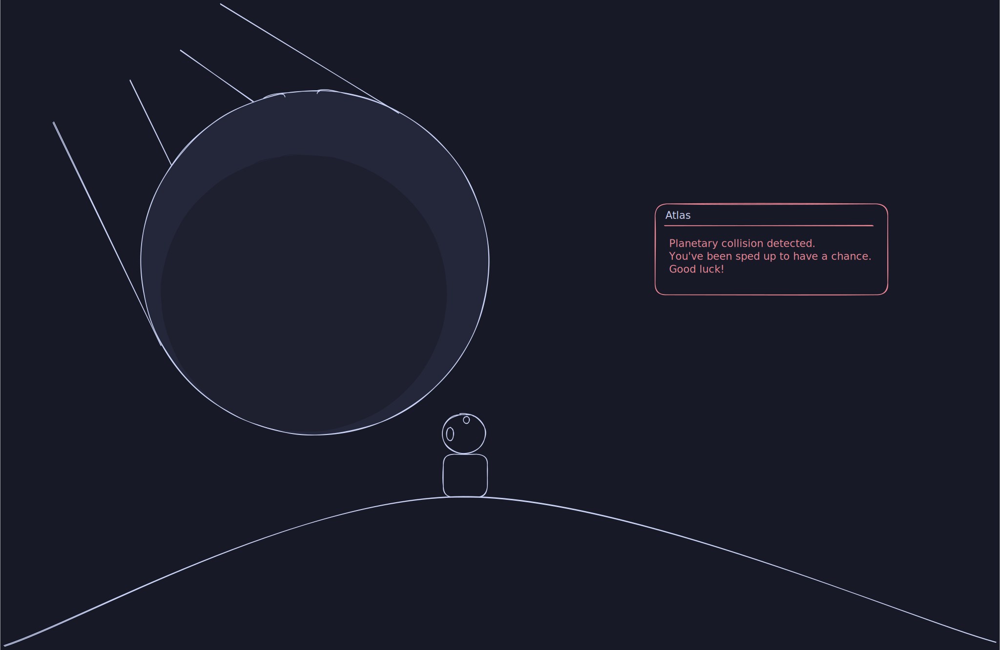

# Planetary Collision

Atlas calls out to you as you face annihilation: a huge object (another planet perhaps?) rapidly approaches your location.

- Overdrive: thinking speed in the affected area increases (effectively slowing down server execution, also letting physics simulation keep up with the mayhem)
- Thinkers should probably dodge the incoming planet and debris or something, alternatively become part of the crater that will surely be left